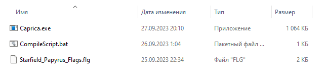
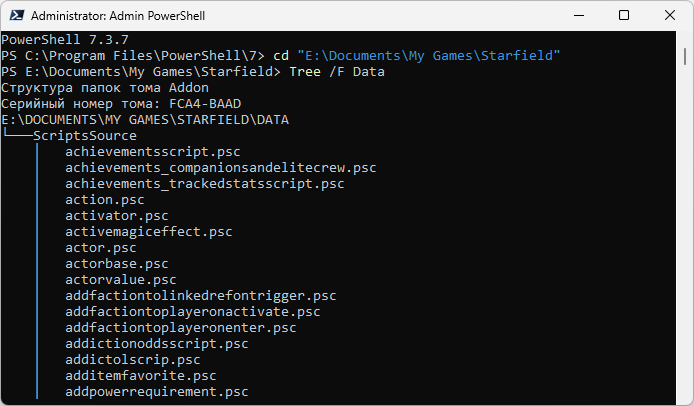

# Создание модов

## Инструменты

+ [Bethesda Archive Extractor](https://www.nexusmods.com/starfield/mods/165) - для извлечения ресурсов из BA2-архивов.
+ [xEdit Experimental](https://discord.com/invite/5t8RnNQ) - для просмотра ESP/ESM/ESL-плагинов.
+ [NifSkope 2.0 Dev](https://github.com/hexabits/nifskope/releases) - для просмотра и экспорта моделей.
+ [Champollion](https://github.com/Orvid/Champollion/actions) и [Caprica](https://github.com/Orvid/Caprica/actions) - для работы со скриптами.
+ [Notepad++](https://notepad-plus-plus.org/downloads/) - простейший текстовой редактор с подсветкой синтаксиса.
+ [Mega:Share](https://link.meridiano-web.com/mega:share) / Starfield / Modding / TexConv-Wrapper.zip - для конвертации текстур.

## Текстуры

Для разных текстур Старфилд использует разное сжатие, поэтому вы можете открывать и редактировать DDS-файлы игры как обычно, но сохранять их обратно вам придётся аккуратно. Есть разные плагины для Фотошопа, ГИМПа, Paint.NET, но автор данной статьи не гарантирует, что они покрывают все типы сжатия, которые используются в игре. Они следующие:
+ Для объектов
    + \_color, \_emissive - BC1_UNORM_SRGB.
    + \_ao, \_metal, \_rough, \_transmissive, \_opacity, \_height, \_mask - BC4_UNORM.
    + \_normal - BC5_SNORM.
+ Для лиц и тел
    + \_color - R8G8B8A8_UNORM_SRGB
    + \_ao, \_rough, \_mask - R8_UNORM.
    + \_normal - R8G8B8A8_SNORM.
+ Для эффектов
    + Градиенты - B8G8R8A8_UNORM.
	+ LUT-текстуры (не-HDR) - R8G8B8A8_UNORM.
	+ LUT-текстуры (HDR) - BC6H_UF16.
+ Для интерфейса
    + Изображения в меню - BC3_UNORM.
    + Загрузочные экраны и изображения из фото-мода - BC7_UNORM.

Обратите особое внимание на UNorm/SNorm и sRGB/Linear, это важно. Плагины могут не отображать такие детали, поэтому в [Инструментах](#инструменты) существует утилита "TexConv Wrapper", в которой вы можете указать сжатие в ini-файле вручную, руководствуясь схемой [DXGI_FORMAT](https://learn.microsoft.com/en-us/windows/win32/api/dxgiformat/ne-dxgiformat-dxgi_format). Утилита не делает ничего сама, она использует [TexConv](https://github.com/microsoft/DirectXTex/releases/latest), который точно поддерживает все вышеперечисленные форматы сжатия.

## Скрипты

Пока что официального исходного кода скриптов и компилятора для них нет, но написание и компиляция скриптов вполне доступны в экспериментальном режиме.

**Декомпиляция**

1. Для начала вам потребуется извлечь папку Scripts из архива игры "Starfield - Misc.ba2".
2. Скачайте последнюю версию Champollion и создайте следующую структуру из файлов и папок:

    

3. Содержимое файла "Run-Normal.bat" следующее:
```
Champollion 0_compiled -p 1_decompiled -a 2_assembly -t -r
pause
```
4. Запустите "Run-Normal.bat" и дождитесь декомпиляции PEX-файлов до PSC-файлов, которые будут находиться в папке "1_decompiled".

**Компиляция**

1. Создайте в папке игры, где лежит Starfield.exe, папку PapyrusCompiler.
2. Скопируйте в неё файл "Caprica.exe" и создайте в ней файл "CompileScript.bat". Рабочее пространство должно выглядеть следующим образом:

    

3. Содержимое файла "CompileScript.bat" следующее:
```
cd /d "%~dp0"
rem Обязательно замените значение SFData на собственное!
set SFData=E:\Documents\My Games\Starfield\Data
set Import=%SFData%\ScriptsSource
set Output=%SFData%\Scripts
caprica.exe --game starfield --import "%Import%" --output "%Output%" "%Import%\%1"
pause
```
4. В папке SFData создайте папку ScriptsSource и перенесите в неё декомпилированные скрипты игры так, чтобы структура папок была следующей:

    

5. Теперь вы можете создавать и писать скрипты в папке MO2 > Overwrite > ScriptsSource, например, такого содержания:
```
ScriptName ExampleScript Extends ScriptObject

Function ExampleFunction(String sInput) Global
    Debug.Notification("Welcome! " + sInput)
EndFunction
```
6. Для компиляции этого скрипта через Notepad++ запустите его через MO2 и воспользуйтесь функцией Run > Run. Укажите в ней следующую команду (замените путь к BAT-файлу на свой):
```
"F:\SteamLibrary\steamapps\common\Starfield\PapyrusCompiler\CompileScript.bat" $(FILE_NAME)
```
7. Для быстрого доступа к этой команде вы можете сохранить её в Notepad++ под названием "Compile Papyrus SF". Она всегда будет компилировать тот файл, который открыт в Notepad++ и находится в фокусе. Результат компиляции (PEX-файл) будет находиться в папке Overwrite/Scripts MO2, т.е. вы сможете создать мод из её содержимого: ПКМ по Overwrite > Create Mod. Важно запускать Notepad++ из MO2, чтобы программа и BAT-файл участвовали в виртуальном окружении MO2, и результат всегда был под контролем.
8. Для проверки работы написанного скрипта запустите игру, загрузите любое сохранение и используйте следующую консольную команду:
```
CGF "ExampleScript.ExampleFunction" "Example String."
```

------

|[*Назад к оглавлению*](https://github.com/Meridiano/Starfield-Head)|
|:---:|