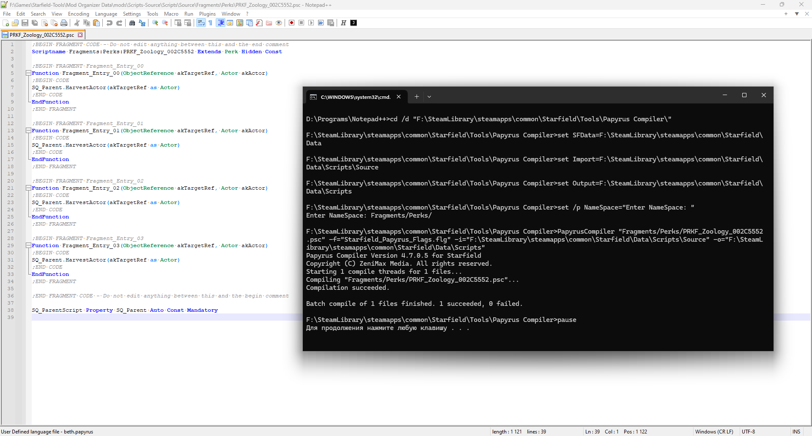

# Создание модов

## Инструменты

+ [Bethesda Archive Extractor](https://www.nexusmods.com/starfield/mods/165) - для извлечения ресурсов из BA2-архивов.
+ [xEdit Experimental](https://discord.com/invite/5t8RnNQ) - для создания и редактирования ESM-плагинов.
+ [Creation Kit (Steam)](https://store.steampowered.com/app/2722710/Starfield_Creation_Kit/) - для создания ESM и редактирования ESP.
+ [xTranslator](https://www.nexusmods.com/starfield/mods/313) - для перевода модов.
+ [NifSkope 2.0 Dev](https://github.com/fo76utils/nifskope/releases) - для просмотра и базового редактирования моделей.
+ [Champollion](https://github.com/Orvid/Champollion/releases/latest) - для декомпиляции скриптов, если автор не дал PSC.
+ [Notepad++](https://notepad-plus-plus.org/downloads/) - простейший текстовой редактор с подсветкой синтаксиса.
+ [Mega:Share](https://link.meridiano-web.com/mega:share) / Starfield / Modding / TexConv-Wrapper.zip - для конвертации текстур.

## Модели и материалы

Для Старфилда NIF-файлы больше не содержат геометрию моделей и пути к текстурам, они только соединяют вместе сетки и материалы, а материалы "указывают" на текстуры. Они имеют расширение MAT, но являются простыми JSON-файлами. Все материалы находятся в архиве "SFBGS007 - Main.ba2" в папке Data игры, их больше 48 тысяч, есть [список](Создание-модов/Starfield-Materials-1.11.36.txt). Если тебе нужно создать новый материал, то выбери из ванильных наиболее подходящий, отредактируй его и сохрани как новый MAT-файл. Альтернативный метод - редактор материалов Creation Kit (View > Material Editor), но гайдов по нему пока немного.

Самый активный Дискорд-сервер, посвященный моделям игры, это [Starfield Geometry Bridge](https://discord.com/invite/4eKExKkKF7).

## Текстуры

Для разных текстур Старфилд использует разное сжатие, поэтому вы можете открывать и редактировать DDS-файлы игры как обычно, но сохранять их обратно вам придётся аккуратно. Есть разные плагины для Фотошопа, ГИМПа, Paint.NET, но автор данной статьи не гарантирует, что они покрывают все типы сжатия, которые используются в игре. Они следующие:
+ Для объектов
    + \_color, \_emissive - BC1_UNORM_SRGB.
    + \_ao, \_metal, \_rough, \_transmissive, \_opacity, \_height, \_mask - BC4_UNORM.
    + \_normal - BC5_SNORM.
+ Для лиц и тел
    + \_color - R8G8B8A8_UNORM_SRGB
    + \_ao, \_rough, \_mask - R8_UNORM.
    + \_normal - R8G8B8A8_SNORM.
+ Для эффектов
    + Градиенты - B8G8R8A8_UNORM.
	+ LUT-текстуры (не-HDR) - R8G8B8A8_UNORM.
	+ LUT-текстуры (HDR) - BC6H_UF16.
+ Для интерфейса
    + Изображения в меню - BC3_UNORM.
    + Загрузочные экраны и изображения из фото-мода - BC7_UNORM.

Обратите особое внимание на UNorm/SNorm и sRGB/Linear, это важно. Плагины могут не отображать такие детали, поэтому в [Инструментах](#инструменты) существует утилита "TexConv Wrapper", в которой вы можете указать сжатие в ini-файле вручную, руководствуясь схемой [DXGI_FORMAT](https://learn.microsoft.com/en-us/windows/win32/api/dxgiformat/ne-dxgiformat-dxgi_format). Утилита не делает ничего сама, она использует [TexConv](https://github.com/microsoft/DirectXTex/releases/latest), который точно поддерживает все вышеперечисленные форматы сжатия.

## Плагины

Для Starfield изменились некоторые привычные практики. На самом деле они изменились давно, но никто об этом не знал. Итак, основные положения.
+ У плагинов есть флаги, основные это Master, Small и Medium. Некоторым они известны как ESM, ESL и ESH.
+ У плагинов есть расширения, это \*.esp и \*.esm, обратите внимание - \*.esl больше не используется.
+ Плагины с расширением \*.esp больше не выпускаются в релиз, они существуют только для редактирования в CK и экспорта в \*.esm с обязательным флагом Master (ESM).
+ Плагины с количеством новых записей до 4096 могут быть преобразованы в Small Master (ESM+ESL). Лимит таких плагинов = 4096.
+ Плагины с количеством новых записей до 65536 могут быть преобразованы в Medium Master (ESM+ESH). Лимит таких плагинов = 256.
+ Плагины с большим числом новых записей должны оставаться Full Master (ESM). Лимит таких плагинов = 253 (256 минус 3 слота под runtime-записи, ESL и ESH).

**Конвертация xEdit > CK**

1. Установите и запустите любой HEX-редактор. Автор данной статьи использует [HxD](https://mh-nexus.de/en/hxd/).
2. Откройте нужный \*.esm файл и найдите там байт 0x00000008.

    

3. Вычтите из байта 0x01. Например, 0x01-0x01=0x00 или 0x81-0x01=0x80. Перепишите значение этого байта на новое.
4. Сохраните изменения как новый файл с расширением \*.esp вместо \*.esm, чтобы не перезаписывать оригинал.
5. Теперь вы можете редактировать этот \*.esp файл в CK и там же экспортировать его как Full Master, Small Master или Medium Master.

## Скрипты

**Компиляция**

1. После загрузки Creation Kit из Steam у вас есть доступ к исходному коду скриптов и компилятору. Найдите папку "Tools" в корне игры и откройте архив "ContentResources.zip". Переместите исходный код из архива в отдельный мод внутри MO2 так, чтобы его структура была следующей.

    

    > Не забудьте подключить мод и поставить ему как можно более низкий приоритет, чтобы остальные моды перезаписывали его.

2. Найдите папку "Starfield/Tools/Papyrus Compiler", в которой лежит "PapyrusCompiler.exe", и создайте в ней файл "CompileScript.bat".
3. Содержимое BAT-файла следующее:
    ```
    cd /d "%~dp0"
    rem Обязательно замените значение SFData на собственное!
    set SFData=F:\SteamLibrary\steamapps\common\Starfield\Data
    set Import=%SFData%\Scripts\Source
    set Output=%SFData%\Scripts
    set /p NameSpace="Enter NameSpace: "
    PapyrusCompiler "%NameSpace%%1" -f="Starfield_Papyrus_Flags.flg" -i="%Import%" -o="%Output%"
    pause
    ```
4. Теперь вы можете создавать и писать скрипты в папке MO2 > Overwrite > Scripts > Source, например, такого содержания:
    ```
    ScriptName ExampleScript Extends ScriptObject
    
    Function ExampleFunction(String sInput) Global
        Debug.Notification("Welcome! " + sInput)
    EndFunction
    ```
5. Для компиляции этого скрипта через Notepad++ запустите его через MO2 и воспользуйтесь функцией Run > Run. Укажите в ней следующую команду (замените путь к BAT-файлу на свой):
    ```
    "F:\SteamLibrary\steamapps\common\Starfield\Tools\Papyrus Compiler\CompileScript.bat" $(FILE_NAME)
    ```
    > Вы можете не указывать значение NameSpace, тогда будет скомпилирован виртуальный файл "Data/Scripts/Source/$(FILE_NAME)". Вы можете указать NameSpace вида SubA/SubB/ (обратите внимание на последний слэш), тогда будет скомпилирован виртуальный файл "Data/Scripts/Source/SubA/SubB/$(FILE_NAME)". При этом сам скрипт должен относиться к нужному NameSpace следующим образом: "ScriptName SubA:SubB:ExampleScript Extends ScriptObject".

    

6. Для быстрого доступа к этой команде вы можете сохранить её в Notepad++ под названием "Compile Papyrus SF". Она всегда будет компилировать тот файл, который открыт в Notepad++ и находится в фокусе. Результат компиляции (PEX-файл) будет находиться в папке Overwrite/Scripts MO2, т.е. вы сможете создать мод из её содержимого: ПКМ по Overwrite > Create Mod. Важно запускать Notepad++ из MO2, чтобы программа и BAT-файл участвовали в виртуальном окружении MO2, и результат всегда был под контролем.
7. Для проверки работы написанного скрипта запустите игру, загрузите любое сохранение и используйте следующую консольную команду:
    ```
    CGF "ExampleScript.ExampleFunction" "Example String."
    ```

**Декомпиляция**

1. Скачайте последнюю версию Champollion и создайте следующую структуру из файлов и папок:

    

2. Содержимое файла "Run-Normal.bat" следующее:
    ```
    Champollion 0_compiled -p 1_decompiled -a 2_assembly -t -r
    pause
    ```
3. Посестите PEX-скрипты, которые нужно декомпилировать, в папку "0_compiled".
4. Запустите "Run-Normal.bat" и дождитесь декомпиляции PEX-файлов до PSC-файлов, которые будут находиться в папке "1_decompiled".
5. Учтите, что синтаксис Champollion может быть неправильным для некоторых функций, в первую очередь это структуры Guard, LockGuard, EndLockGuard. Если так, то вы не сможете компилировать скрипт обратно as-is, вам придётся понять его структуру и переписать под синтаксис официального компилятора.

## Переводы

Установите xTranslator в вашу папку "Starfield Tools" и запустите его в режиме Starfield. Большинство настроек можно оставить по умолчанию, самое главное - это направление перевода "en-ru".

**Создание словаря**

+ Скачайте перевод игры (например, от Segnetofaza) и распакуйте его архив.
+ Добавьте xTranslator как исполняемый файл в MO2 и запустите программу.
+ Используйте "File > Load ESP/ESM" и выберите "Starfield.esm", это загрузит плагин и его Strings-файлы.
+ Используйте "Tools > Load .Strings as translation" и выберите файл перевода "starfield_ru.strings".

    

+ Сохраните основной словарь игры нажатием Ctrl+S.

**Перевод плагина**

+ Плагины игры - это файлы ESM. Откройте xTranslator с уже готовым словарём и загрузите нужный плагин.
+ Для примера я использую популярный мод "StarfieldCommunityPatch.esm", который тоже использует Strings-файлы.
+ На момент написания гайда число строк, которые xTranslator не подхватывает автоматически, составляет 22, их вам и нужно перевести.
+ Поскольку у вас есть созданный словарь игры, варианты перевода вам может предложить раздел Heuristic Suggestions.

    

+ Дабл-клик по варианту перенесёт его в окно перевода строки, где вы сможете подтвердить перевод.
+ Когда все красные строки станут синими и вас устроит сделанный перевод, вы сможете сохранить словарь мода нажатием Ctrl+S.
+ Наконец, вам нужно завершить перевод, используйте "File > Finalize Strings" и подтвердите создание файлов.
+ Закройте xTranslator и убедитесь, что в папке Overwrite MO2 появились русские Strings-файлы мода.

    

+ Теперь вы можете создать мод из содержимого Overwrite и назвать его "Starfield Community Patch Russian".

**Дополнительно**

+ Перевод плагинов, которые не используют Strings-файлы, мало чем отличается. При использовании опции Finalize вы получите не новые Strings-файлы, а переведённый плагин и его английский бэкап.
+ Перевод TXT-файлов интерфейса, которые лежат в "Data\Interface\Translation" тоже почти не отличается, вы используете "File > Load MCM/Custom Text File", а на выходе получаете TXT-файл с припиской \_ru вместо \_en.
+ Некоторые моды имеют строки внутри скриптов, например в функции Debug.Notification("You have been fired!"). У вас есть два способа перевода таких скриптов.
    + Первый способ. Заменить текст на русский и рекомпилировать скрипт.
    + Второй способ. Кириллица при компиляции никогда не приживалась достаточно хорошо, даже после перехода Беседки на UTF-8, поэтому второй способ - это редактирование PEX-файлов напрямую через xTranslator. Зайдите в настройки программы "Options > Advanced Options", перейдите на вкладку "Scripts And VMAD" и укажите путь к внешнему декомпилятору "Champollion.exe", который вы скачивали специально для Старфилда. Теперь вы сможете загружать в xTranslator PEX-файлы модов, при этом для редактирования будут доступны только "безопасные" строки, которые не сломают игру. Анализ программы довольно сносный, также вы не сможете перевести "Health" как "Здоровье" и сломать восстановление параметра "Health", потому что для этого в игре используются записи из плагинов, а не строки.

------

|[*Назад к оглавлению*](https://github.com/Meridiano/Starfield-Head)|
|:---:|