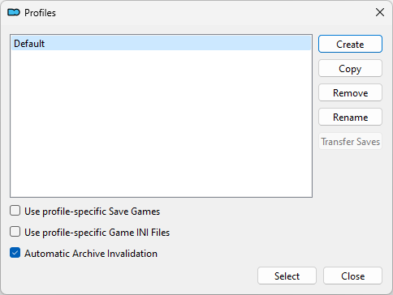

# Установка модов

## Базовый гайд для MO2

**Мод-менеджер**

+ Заведи себе папку "Starfield Tools" на том же диске, где находится твоя игра, и создай в ней подпапку "Mod Organizer 2".
+ Зайди на Дискорд-сервер [Mod Organizer 2](https://link.meridiano-web.com/mo2devs) и скачай последний Archive-билд 2.5 в канале [dev-builds](https://discord.com/channels/265929299490635777/379225566122999808).
+ Скопируй содержимое архива в свою папку "Starfield Tools/Mod Organizer 2" и запусти "ModOrganizer.exe".
+ Выбери "portable instance", чтобы MO2 не мешал другим твоим играм, затем выбери из списка игру "Starfield".
+ Пройди обучалку и по возможности запомни её. В процессе установи с NexusMods любой мод, который ставится в папку Data игры.
+ Обязательно зайди в настройки профиля и поставь галочку "Automatic Archive Invalidation".

    

**Starfield Script Extender**

+ Скачай его с NexusMods по [ссылке](https://www.nexusmods.com/starfield/mods/106). Выбери ту версию, которая сделана для твоей версии игры.
+ Скопируй sfse_X_X_X.dll и sfse_loader.exe из архива в папку с игрой, где лежит Starfield.exe.
+ Перезапусти MO2, чтобы ярлык SFSE появился в списке исполняемых файлов.
+ Запускай игру исключительно через MO2 > SFSE или создай ярлык SFSE через MO2, чтобы запускать игру без GUI мод-менеджера.
+ Чтобы проверить работу SFSE, запусти игру и зайди в настройки, слева снизу будет версия игры и SFSE.

**Дополнения**

+ Если мод требуется поместить в корень игры, делай это вручную, не используй MO2.
+ Если мод требуется установить в папку Data игры, просто установи его через MO2.
+ Если мод содержит контент и для корня игры, и для папки Data, то файлы для корня игры ставятся вручную, а остальное - через MO2.
+ Если мод требует изменить содержимое ini-файла игры (StarfieldCustom.ini или StarfieldPrefs.ini), то используй инструмент MO2, Tools > INI Editor.

------

|[*Назад к оглавлению*](https://github.com/Meridiano/Starfield-Head)|
|:---:|