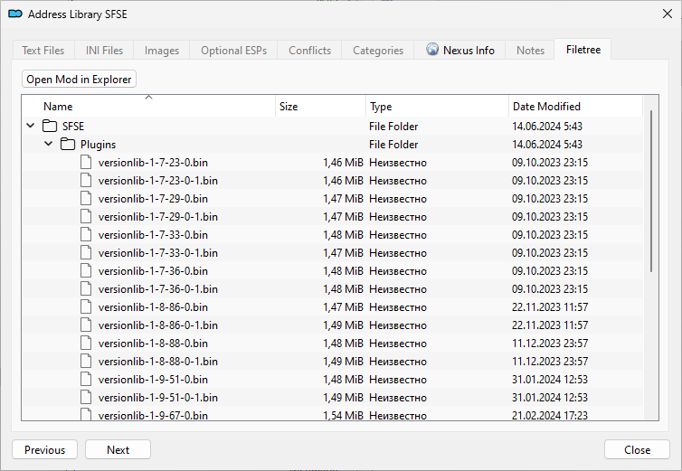
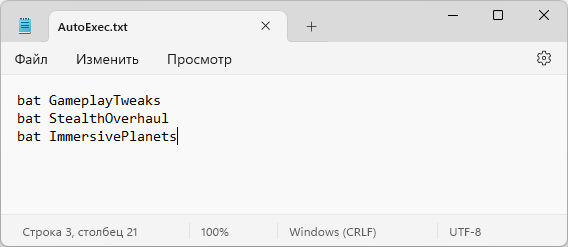

# Установка модов

## Базовый гайд для MO2

**Мод-менеджер**

+ Заведи себе папку "Starfield Tools" на том же диске, где находится твоя игра, и создай в ней подпапку "Mod Organizer 2".
+ Зайди на Дискорд-сервер [Mod Organizer 2](https://link.meridiano-web.com/mo2devs) > [dev-builds](https://discord.com/channels/265929299490635777/379225566122999808) и скачай последний билд "Archive" (130+ мегабайт).
+ Скопируй содержимое архива в свою папку "Starfield Tools/Mod Organizer 2" и запусти "ModOrganizer.exe".
+ Выбери "portable instance", чтобы MO2 не мешал другим твоим играм, затем выбери из списка игру "Starfield".
+ Пройди обучалку и по возможности запомни её. В процессе установи с NexusMods мод [Address Library](https://www.nexusmods.com/starfield/mods/3256).
+ Структура мода должна быть следующей. На будущее запомни: всё, что устанавливается в папку Data, устанавливается через MO2 так, чтобы структура мода совпадала со структурой папки Data. "Some New Mod/Data/Interface/FontConfig_en.txt" - неправильно, "Some New Mod/Interface/FontConfig_en.txt" - правильно.

    

+ Обязательно зайди в настройки профиля и поставь галочку "Automatic Archive Invalidation".

    

+ Для удобства там же поставь остальные галочки.
    + Profile-Specific Save Games > Твои сохранения будут находиться в профиле MO2 и эмулироваться в Документы на время игры.
    + Profile-Specific Game INI Files > Твои ini-файлы будут находиться в профиле MO2 и эмулироваться в Документы на время игры.

**Starfield Script Extender**

+ Скачай его с NexusMods по [ссылке](https://www.nexusmods.com/starfield/mods/106). Выбери ту версию, которая сделана для твоей версии игры.
+ Скопируй sfse_X_X_X.dll и sfse_loader.exe из архива в папку с игрой, где лежит Starfield.exe.
+ Перезапусти MO2, чтобы ярлык SFSE появился в списке исполняемых файлов.
+ Запускай игру исключительно через MO2 > SFSE или создай ярлык SFSE через MO2, чтобы запускать игру без GUI мод-менеджера.
+ Чтобы проверить работу SFSE, запусти игру и зайди в настройки, слева снизу будет версия игры и SFSE.

**Дополнения**

+ Если мод требуется поместить в корень игры, делай это вручную, не используй MO2.
+ Если мод требуется установить в папку Data игры, просто установи его через MO2.
+ Если мод содержит контент и для корня игры, и для папки Data, то файлы для корня игры ставятся вручную, а остальное - через MO2.
+ Если мод требует изменить содержимое ini-файла игры (StarfieldCustom.ini или StarfieldPrefs.ini), то используй инструмент MO2, Tools > INI Editor.

**Лимиты модов**

+ Условно говоря, моды состоят из плагинов и ресурсов, плагины имеют расширение ".esm", ресурсы - это всё остальное.
+ Лимит есть только у плагинов, в настоящий момент (на версии игры 1.13.XX) это около 100 плагинов. Почему "около" - каждый плагин занимает требуемые ему индексы из общего пула, максимальное число равно 255. При этом плагины могут занимать больше одного индекса, это зависит от числа мастер-файлов, от перезаписи, в общем - от содержимого плагина и его позиции в списке. Все плагины, которые попытаются использовать индексы выше 255, будут загружены частично или неправильно и работать не будут. В число симптомов входит бесконечная загрузка при начале новой игры, пропадающие объекты и части кораблей (поскольку плагин BlueprintShips загружается последним и всегда выходит за лимит, если тот превышен).
+ Чтобы узнать, превышен лимит в твоей сборке или нет, используйте мод [Starfield Engine Fixes](https://www.nexusmods.com/starfield/mods/10457), укажите bHighModIndexWarningMainMenu=1 и bHighModIndexWarningPauseMenu=1 в его файле настроек. Если самый большой индекс в твоём списке выше 200, то при загрузке сейва тебе будет показано предупреждение и дан выбор, продолжить загрузку или нет. Число ниже 250 считается безопасным. Подробнее читай [здесь](https://www.nexusmods.com/starfield/articles/635).
+ Важно понимать, что этот "soft" лимит не связан с более фундаментальным "hard" лимитом плагинов (253 полных + 256 средних + 4096 маленьких). Это нечто новое и относится только к Старфилду.

**Авто-выполнение batch-файлов**

+ Правка файла "StarfieldCustom.ini". В секции [General] добавь параметр "sStartingConsoleCommand=bat AutoExec" без кавычек.
+ Создай в папке Overwrite MO2 файл "AutoExec.txt", затем создай из Overwrite новый мод и подключи его.
+ Устанавливай batch-файлы с Нексуса и других источников так, чтобы их файлы находились на верхнем уровне модов в MO2.
+ Вноси эти batch-файлы в свой файл "AutoExec.txt", чтобы регулировать их список и порядок выполнения.

    

------

|[*Назад к оглавлению*](https://github.com/Meridiano/Starfield-Head)|
|:---:|