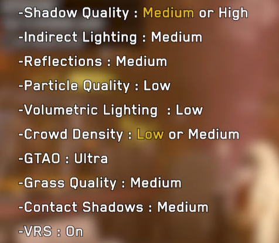

# Вопросы и ответы

> Информация от анонимов для анонимов.

------

В: Какие настройки игры более оптимальные?

О: Примерно такие, версия от [BenchmarKing](https://www.youtube.com/@benchmarking4386).



Примечания: объемное освещение не работает, как и качество частиц. Автоматическое разрешение лучше убрать. Крутите ползунок рендеринга до получения стабильных 60 FPS в шахтерском городе. Замерять в Новой Атлантиде (New Atlantis) не рекомендуется, так как стабильные 60 FPS вы там не получите никогда. Далее - метод апскейла. По умолчанию есть FSR, можно переключить на DLSS для карточек Nvidia. Согласно коллективному мнению DLSS лучше, но на самом деле разницы особой нет, просто у DLSS изначально нет повышения резкости, поэтому изображение более мыльное, но более стабильное, без мерцания. Мерцание зависит от резкости, больше резкости - меньше мыла, но больше мерцания. Найдите золотую середину. Для DLSS можно накатить поверх ReShade с пресетом на увеличение резкости и любоваться на баннеры при запуске.

------

В: Как включить РеБАР (NVIDIA Resizable BAR)?

О: Скачать [Nvidia Profile Inspector](https://github.com/Orbmu2k/nvidiaProfileInspector/releases/latest). Найти там игру Starfield. В секции 5 (Common) установить значения:
```
rBar - Feature Enabled
rBar - Options 0x00000001 (Battlefield V, Returnal etc.)
rBar - Size Limit 0x0000000040000000 (Battlefield V, F2 2022 etc.)
```
Кликнуть "Apply Changes" наверху справа.

Вариант второй - обновить свой драйвер, включенный РеБАР по умолчанию добавили в версии 537.34 от 12 сентября 2023.

------

В: Какие есть моды на вкус и цвет?

О: Твики ini-файлов описаны в статье [Как сделать X](Как-сделать-X.md). Некоторые моды описаны в [Списках модов](../Моддинг/Списки-модов.md).

------

В: Хочу советов мудрых, есть такие?

О: Есть.

+ Не рекомендуется убирать LUT-текстуры полностью. Игра изначально задумывалась под фильтры, уникальные пресеты используют как целые планеты, так и отдельные помещения. Убирать их - значит лишать себя визуального разнообразия и в конечном счёте снижать качество картинки, так как фильтры сглаживают недостатки окружения. Вместе с модами на LUT-текстуры можно установить гамму на 2.3 (чуть темнее), параметр описан в [Как сделать X > Графика](Как-сделать-X.md#графика).
+ Производительные INI-пресеты с NexusMods сделаны так, что они всегда снижают конечное качество картинки, это не "бесплатные" лишние FPS. Если вы используете такой готовый пресет от любого из авторов, рекомендуется разобраться, что и как было изменено, чтобы потом не жаловаться на ухудшение графики по неизвестным причинам.

------

|[*Назад к оглавлению*](https://github.com/Meridiano/Starfield-Head)|
|:---:|